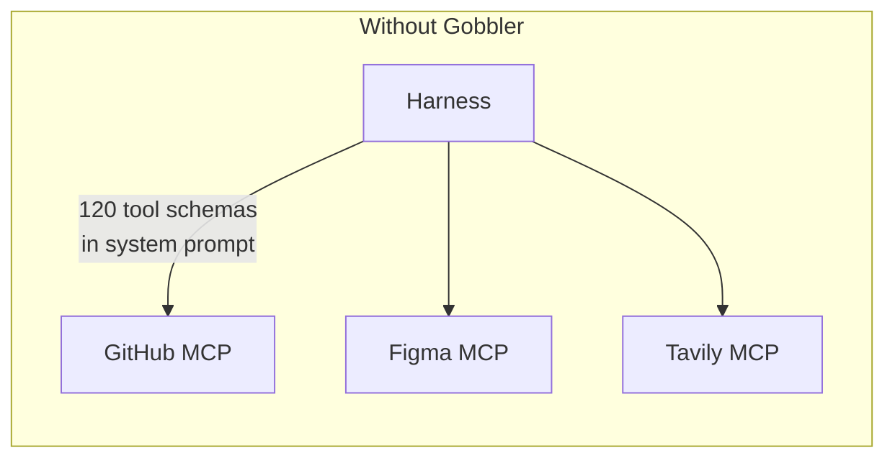
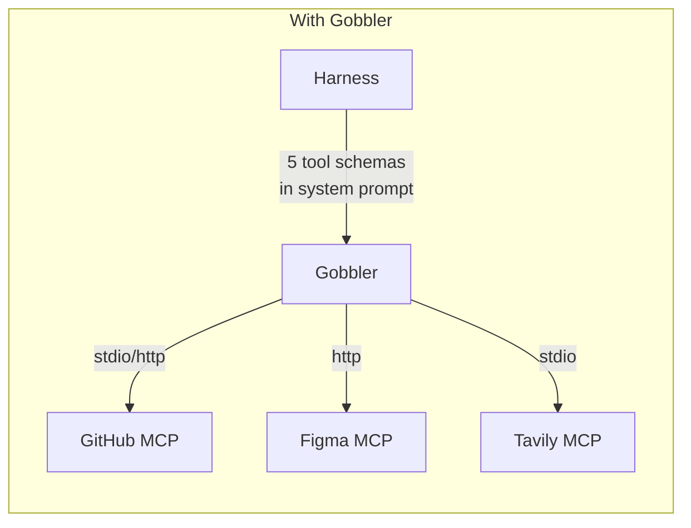
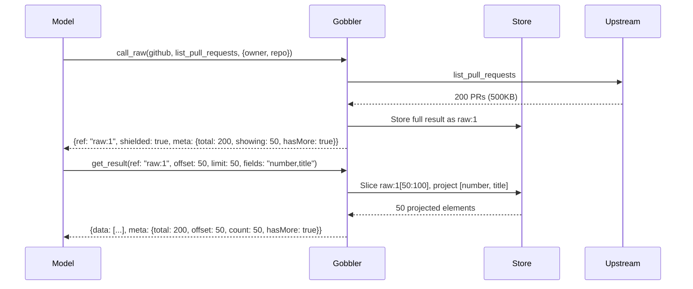
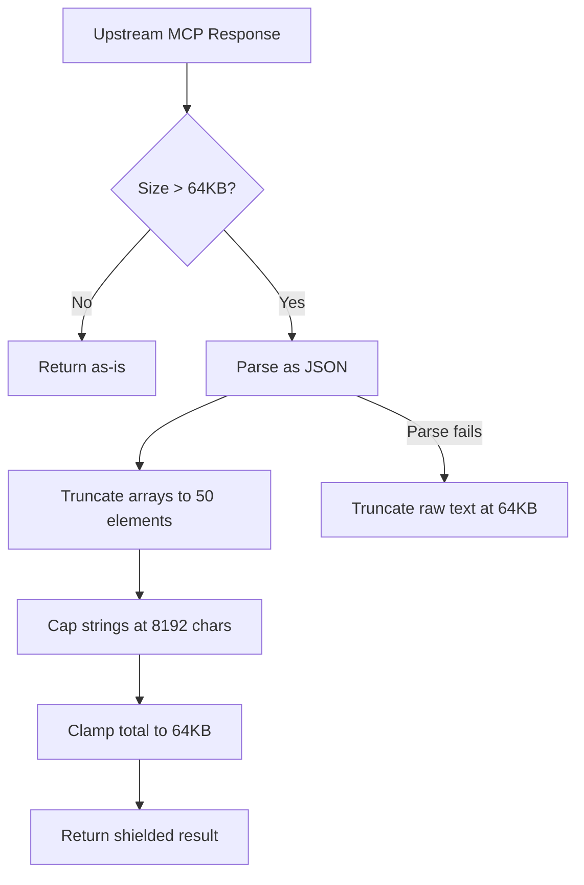
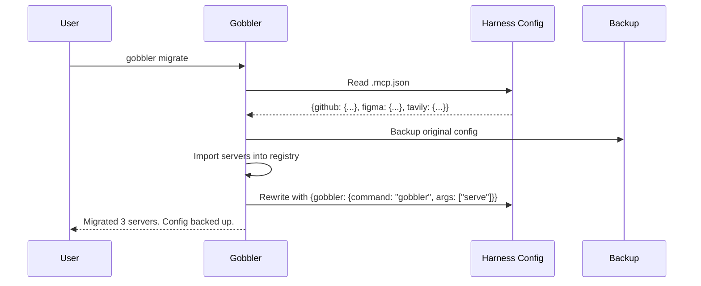
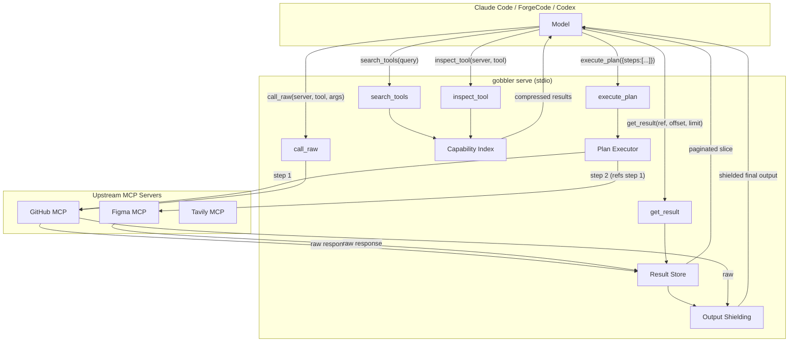

# Gobbler

Gobbler is a local MCP gateway that sits between your coding harness and your MCP servers. It replaces the full tool surface with 5 wrapper tools. The harness never sees the upstream servers directly.

I built this because MCP tool schemas are expensive. The GitHub MCP server exposes 40+ tools. Each one carries a JSON Schema definition, parameter descriptions, and annotations that get injected into every prompt. The model reads all of it, every time. Cloudflare measured this problem in production and found that collapsing tool surfaces cut their token usage by 81%. Gobbler applies the same compression locally, in a single Go binary, without requiring Cloudflare Workers or TypeScript runtimes.

The second problem is response size. A `list_pull_requests` call can return 500KB of JSON. That entire payload gets dumped into the model's context. Gobbler intercepts it. Arrays get truncated to 50 elements. Strings get capped at 8192 characters. Total output gets clamped to 64KB. But the raw data is not discarded. It stays in gobbler's process memory, addressable by a ref handle. The model can page through truncated results using `get_result` with offset and limit parameters.

## How the compression works

Without gobbler, every tool definition from every MCP server is injected into the harness prompt. 3 servers with 40 tools each means 120 tool schemas in the system prompt, consuming thousands of tokens before the model does anything useful.

With gobbler, the harness sees exactly 5 tool definitions. The model discovers capabilities by calling `search_tools`, builds execution plans, and pages through results as needed.





The harness prompt shrinks from 120 tool definitions to 5. The model loses nothing because `search_tools` returns exactly the capabilities it needs, on demand, in a compressed format that costs roughly 100 tokens per query.

## The 5 wrapper tools

`search_tools` takes a query string and searches the compiled capability index. The index contains every upstream tool's name, a 120-character summary, inferred tags, risk classification, and parameter shape. The model uses this to discover what's available without loading full JSON Schemas.

`execute_plan` takes a JSON plan with ordered steps. Each step names a server, tool, and arguments. Gobbler executes them sequentially, stores intermediate results in memory, and returns only the final output after applying size limits. Step arguments can reference previous results using `${stepId.field}` syntax.

`call_raw` calls a single upstream tool directly. It is the escape hatch for one-off calls. Output is still subject to response shielding.

`inspect_tool` returns the full parameter schema for a specific tool when `search_tools` returned enough to identify the right tool but not enough to build arguments.

`get_result` pages through a stored result that was truncated. When `execute_plan` or `call_raw` returns a response with `"shielded": true`, the output includes a ref handle and pagination metadata (total count, offset, hasMore). The model calls `get_result` with that ref, an offset, and a limit to retrieve the next page. It also supports field projection: pass `fields: "id,title,state"` to return only those keys from each array element.

## Result pagination

This is the mechanism that makes shielding lossless. Without it, truncation is data loss. With it, truncation is deferred loading.

Every tool call result -- from `execute_plan` and `call_raw` -- is stored in an in-memory result store keyed by a ref handle. The ref format is `p1:s1` for plan step results or `raw:3` for direct calls. Results persist across plans for 10 minutes (configurable), evicted by TTL or LRU when memory exceeds 128MB.

When the shielding enforcer truncates an array from 200 elements to 50, the response includes structured metadata:

```json
{
  "output": "[first 50 elements...]",
  "ref": "p1:s1",
  "shielded": true,
  "meta": {
    "total": 200,
    "offset": 0,
    "count": 50,
    "hasMore": true
  }
}
```

The model sees 50 elements plus a clear signal that 150 more exist. To get elements 50-99:

```json
{"ref": "p1:s1", "offset": 50, "limit": 50}
```

To get only specific fields from elements 100-149:

```json
{"ref": "p1:s1", "offset": 100, "limit": 50, "fields": "id,title,state"}
```

To navigate into nested objects before slicing:

```json
{"ref": "p1:s1", "path": "data.items", "offset": 0, "limit": 25}
```

The store also supports path expressions in `execute_plan` step references. Within a plan, `${s1[50:100]}` slices elements 50-99 from step s1's result and passes them to the next step's arguments. The full path syntax: `ref.field`, `ref[0].field`, `ref[10:20]`, `ref[10:20].field`, `ref[*].field`.



## Response shielding

Every response that crosses the boundary from gobbler back to the harness passes through the output policy enforcer. The enforcer applies 3 transformations:



For `execute_plan`, intermediate step results never leave gobbler. They are stored in an in-memory `resultstore.Store` keyed by plan-scoped ref handles (`p1:s1`, `p2:s1`). The model can reference them in subsequent steps via `${s1.field}` syntax, and the raw payloads persist across plans for 10 minutes. Only the final step's shielded output is returned to the harness. If the model needs data that was truncated, it calls `get_result` with the ref handle.

## The migration flow



`gobbler migrate` reads the existing `.mcp.json` from each detected harness, imports every MCP server entry into gobbler's registry, backs up the original config, and rewrites it with a single `gobbler` entry. One command replaces the entire MCP setup.

## Install

The install script detects your OS and architecture, downloads the latest release binary, and places it in `/usr/local/bin`. If no release exists yet, it falls back to building from source (requires Go 1.22+).

```
curl -sSfL https://raw.githubusercontent.com/robinojw/gobbler/main/install.sh | sh
```

Or install directly with Go:

```
go install github.com/robinwhite/gobbler/cmd/gobbler@latest
```

Or clone and build:

```
git clone https://github.com/robinojw/gobbler.git
cd gobbler
go build -o gobbler ./cmd/gobbler
sudo mv gobbler /usr/local/bin/
```

## Quick start: one-command migration

If you already have MCP servers configured in Claude Code, ForgeCode, or Codex, this is the fastest path.

```
gobbler migrate
```

That command detects every installed harness, reads its `.mcp.json`, imports all servers into gobbler's registry, backs up the original config, and rewrites each harness to point only at gobbler. The `--dry-run` flag shows what would happen without making changes:

```
gobbler migrate --dry-run
```

To migrate a single harness:

```
gobbler migrate --harness claude
```

Verify the migration:

```
gobbler mcp list
gobbler doctor
```

Roll back any harness to its pre-gobbler config:

```
gobbler rollback --harness claude
```

## Manual setup

If you prefer to set things up piece by piece.

Register upstream MCP servers:

```
gobbler mcp add --transport stdio github npx -y @modelcontextprotocol/server-github
gobbler mcp add --transport http figma https://mcp.figma.com/mcp
gobbler mcp add --transport stdio tavily npx -y tavily-mcp-server
```

Build the capability index by connecting to each server and introspecting its tools:

```
gobbler wrap github figma tavily
```

Install gobbler into your harness:

```
gobbler install --harness claude
gobbler install --harness forge
gobbler install --harness codex
```

The harness now sees 5 tools instead of whatever the upstream servers exposed. All tool calls route through `gobbler serve`, which the harness launches automatically via stdio.

## Adding more MCP servers

After the initial setup, adding a new server takes 2 commands:

```
gobbler mcp add --transport stdio sentry npx -y @sentry/mcp-server
gobbler wrap sentry
```

No harness restart required. The new server's capabilities appear in `search_tools` results immediately because the capability index is rebuilt by `gobbler wrap`.

## How it works, end to end



The capability compiler runs at `gobbler wrap` time. It connects to each upstream server via MCP, calls `tools/list`, and builds a `CapabilityIndex`. Each tool becomes a `Capability` struct with a 120-character summary, inferred tags, word-level risk classification (`read`, `write`, or `dangerous`), and a parameter shape string. The index is persisted to `~/.config/gobbler/capabilities/`.

Risk classification uses word-level matching against tool names and descriptions. Words like `delete`, `remove`, `destroy` produce "dangerous". Words like `create`, `update`, `push` produce "write". Everything else defaults to "read". The MCP spec's default annotations (which mark every tool as `DestructiveHint: true` unless overridden) are ignored because they carry no signal.

## Configuration

Gobbler stores its state in `~/.config/gobbler/` on Linux, `~/Library/Application Support/gobbler/` on macOS, and `%APPDATA%/gobbler/` on Windows. Override with `GOBBLER_CONFIG_DIR`.

```
~/.config/gobbler/
  servers.json          # server registry
  capabilities/         # compiled capability indexes (one per server)
  backups/              # timestamped config backups
  logs/                 # stderr logs
```

Output policy defaults:

| Setting | Default | Purpose |
|---|---|---|
| `maxOutputBytes` | 65536 (64KB) | Total response size cap |
| `maxArrayLength` | 50 | Array element limit |
| `maxStringLength` | 8192 | String value cap |
| `stepTimeout` | 30s | Per-step execution timeout |
| `planTimeout` | 120s | Total plan execution timeout |
| `maxSteps` | 10 | Maximum steps per plan |
| `allowMutating` | false | Whether write/dangerous tools are permitted |

## Supported harnesses

| Harness | Config location | Detection | Reload |
|---|---|---|---|
| ForgeCode | `~/.forge/.mcp.json` or `./.mcp.json` | `forge` binary or `~/.forge/` dir | `forge mcp reload` |
| Claude Code | `./.mcp.json` | `claude` binary or `~/.claude.json` | Manual restart |
| Codex | `./.mcp.json` | `codex` binary or `~/.codex/` dir | Manual restart |

## CLI reference

```
gobbler migrate [--harness <name>] [--dry-run]    # one-shot: pull MCPs from harnesses into gobbler
gobbler mcp add --transport <type> <name> <cmd..>  # register an upstream MCP server
gobbler mcp list                                   # list registered servers
gobbler mcp remove <name>                          # remove a server
gobbler wrap <server...>                           # build capability index (introspect tools)
gobbler install --harness <name>                   # inject gobbler into a harness config
gobbler rollback --harness <name>                  # restore pre-gobbler config from backup
gobbler doctor                                     # validate installation and connectivity
gobbler serve                                      # run the MCP wrapper server (stdio)
gobbler harness detect                             # detect installed harnesses
```

## Project structure

The codebase is 5,008 lines of Go across 28 files. No TypeScript, no containers, no cloud dependencies. 2 direct dependencies: `mark3labs/mcp-go` for MCP protocol plumbing and `spf13/cobra` for CLI parsing.

```
cmd/gobbler/           CLI entrypoint
internal/cli/          8 command files wired with cobra
internal/harness/      Adapter interface + forge/claude/codex implementations
internal/mcpclient/    MCP client wrapping mcp-go (stdio + HTTP)
internal/compiler/     Tool schema -> capability index compiler
internal/wrapper/      MCP wrapper server exposing 5 tools
internal/executor/     Multi-step plan executor with step references
internal/policy/       Output shielding: size limits, field filtering, truncation
internal/resultstore/  In-memory store for intermediate step results
internal/backup/       Timestamped config backup and restore
internal/registry/     Server registry persisted to ~/.config/gobbler/servers.json
internal/logging/      Stderr-only logger (stdout reserved for MCP JSON-RPC)
pkg/config/            Config types and JSON file I/O
pkg/protocol/          MCP protocol types and tool schema parsing
```

## Tests

26 tests across 4 packages. Run them with:

```
go test ./...
```

The compiler tests verify tool compilation, capability search, index merging, tag inference, and risk classification. The policy tests verify output shielding for oversized strings, arrays, JSON field filtering, and tool blocking. The registry tests verify CRUD and file persistence. The resultstore tests verify pagination with offset/limit, field projection, array slicing, string slicing, plan-scoped refs, TTL eviction, shape analysis, and cross-plan persistence.

## What this does not do

Gobbler does not run arbitrary model-generated code. The execution model is structured plans: the model submits JSON describing which tools to call with which arguments, and gobbler executes them. There is no eval, no sandbox runtime, no embedded JS engine. Structured execution captures the token savings while avoiding the security surface of code execution.

Gobbler does not replace MCP servers. It proxies them. The upstream servers still run, still handle auth, still do the real work. Gobbler compresses what the harness sees and shields what it receives.
