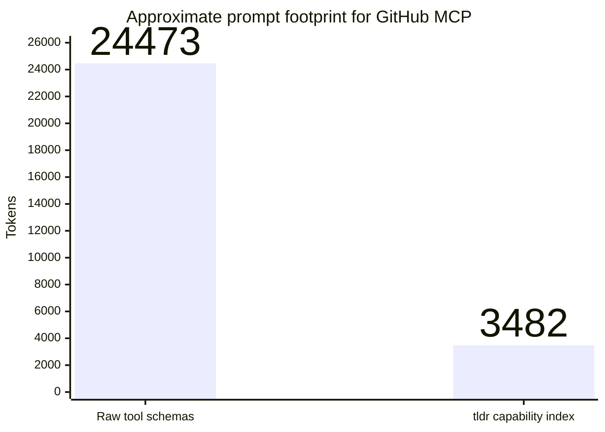
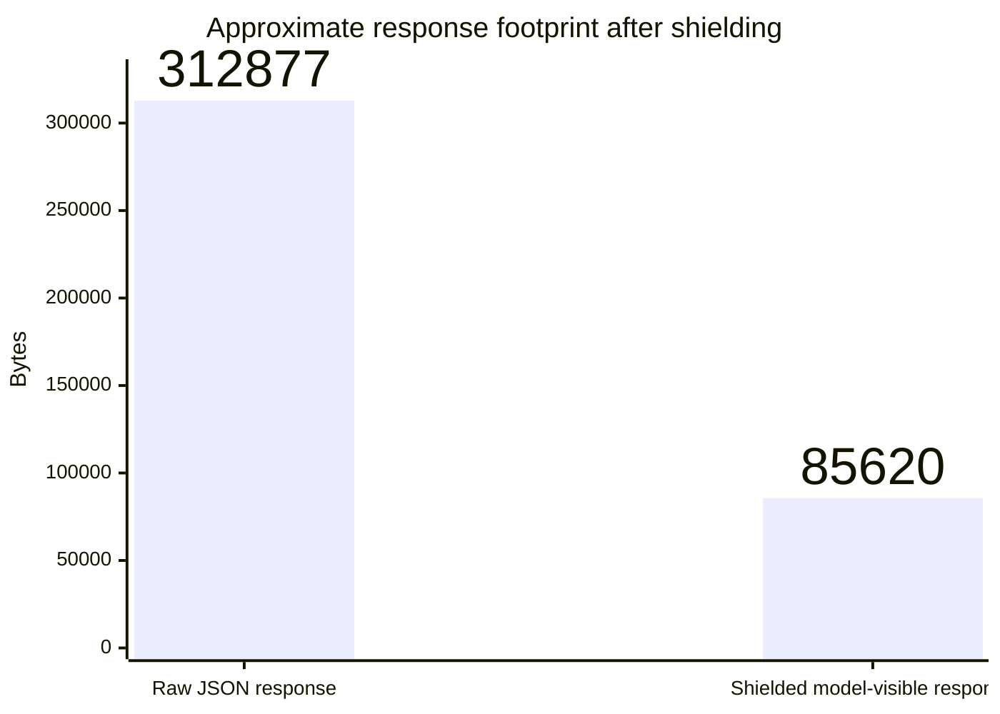

# tldr

`tldr` is a local MCP gateway for coding harnesses.

Install it with:

```sh
curl -sSfL https://raw.githubusercontent.com/robinojw/tldr/main/install.sh | sh
```

It sits between your harness and your upstream MCP servers, replaces a large tool surface with 5 wrapper tools, keeps large intermediate payloads out of the model context, and lets the model page through stored results only when it actually needs them.

In practice, `tldr` is trying to solve two very specific problems:

1. **Too many tool schemas in the prompt**
2. **Too much raw tool output dumped back into the model**

This repository is the Go implementation of that wrapper.

## What `tldr` actually changes

Without `tldr`, a harness connects directly to every MCP server and usually exposes every upstream tool to the model.

With `tldr`, the harness points to a single MCP server entry:

- `tldr serve`

That wrapper only exposes these 5 tools:

1. `search_tools`
2. `execute_plan`
3. `call_raw`
4. `inspect_tool`
5. `get_result`

Those 5 tools are registered directly by the wrapper server in `internal/wrapper/server.go:100-203`, and the harness integration writes `tldr serve` into the harness config in `internal/harness/harness.go:57-63`.

## How this reduces MCP token usage

There are two separate token savings mechanisms.

### 1) Tool-surface compression

The biggest savings come from **not showing the model every upstream tool schema up front**.

When you run `tldr wrap <server...>`, `tldr` connects to each registered upstream server, calls `tools/list`, and compiles every raw MCP tool into a much smaller `Capability` record containing:

- server name
- tool name
- short summary
- inferred tags
- risk level (`read`, `write`, `dangerous`)
- compact input shape
- compact output shape

That compilation happens in `internal/compiler/compiler.go:20-30` and `internal/compiler/compiler.go:51-90`.

Instead of injecting all raw upstream schemas into the harness prompt, the harness only sees the 5 wrapper tools from `internal/wrapper/server.go:100-203`.

The model then discovers capabilities on demand through `search_tools`, which returns a compact text view of matching capabilities using summary, input shape, and tags from `internal/wrapper/server.go:205-236`.

If the model needs more detail for one specific tool, it can call `inspect_tool`, which returns the stored compiled capability entry for that tool in `internal/wrapper/server.go:320-341`.

A useful detail here: `tldr` also computes an **approximate token comparison** during wrapping.

- raw schema tokens are estimated from the serialized tool schema bytes
- wrapped tokens are estimated from the serialized compiled capability index
- the CLI prints the reduction after `tldr wrap`

That logic lives in `internal/compiler/compiler.go:73-88` and the CLI output is produced in `internal/cli/wrap_cmd.go:71-78`.

So the token reduction is not just conceptual: the CLI explicitly compares the approximate size of the original tool schemas versus the compressed capability representation.

For a concrete example, I measured the current GitHub MCP server tool list using the same wrap-time accounting path. With 41 upstream tools, the raw tool schemas come out to about **24,473 tokens**, while the compiled capability index is about **3,482 tokens**.



That is an **~86% reduction** before you even factor in response shielding. The important point is that this is not a hand-wavy estimate from the README; it is produced by the same schema-versus-capability comparison that `tldr wrap` prints for any wrapped server.

### 2) Response shielding

The second savings mechanism is **keeping large responses out of the model context**.

When `tldr` executes a tool call, it stores the raw result locally and applies output shielding before returning anything to the harness.

The shielding rules come from the default policy config in `pkg/config/config.go:64-89` and the enforcement logic in `internal/policy/policy.go:26-110` and `internal/policy/policy.go:173-212`.

By default, the shielding policy combines a byte budget with structural trimming:

- byte-oriented output is targeted to stay within **64 KB**
- arrays are capped at **50 elements**
- strings are capped at **8192 characters**

If a result is too large, `tldr` truncates what the model sees and returns structured metadata showing that more data exists. The raw payload stays in the local result store, which is why truncation is a **defer-load** mechanism rather than blind loss.

For a concrete response-size example, I ran a representative **200-item GitHub-style issues payload** through the same default shielding path. The raw JSON was about **312,877 bytes**, and the shielded result returned to the model was about **85,620 bytes**.



That is an **~73% reduction** before the model does any follow-up paging with `get_result`. In this kind of large array response, the biggest savings come from the default policy trimming the top-level payload down to 50 summarized items while keeping the full raw result available locally.

## How intermediate data stays out of the prompt

`execute_plan` is the main mechanism for multi-step work.

A plan is a list of structured steps, where each step specifies:

- `id`
- `server`
- `tool`
- `arguments`
- optional `dependsOn`

Those types are defined in `internal/executor/executor.go:36-56`.

When a plan runs:

- steps execute with dependency awareness
- steps with no unmet dependencies can run concurrently
- each raw step result is stored locally with a ref like `p1:s1`
- only the final selected output is returned to the model

That behavior is implemented in `internal/executor/executor.go:115-349`.

The important token-saving detail is that **intermediate step outputs do not get streamed back into the harness context**. They stay in the result store and can be referenced by later steps using `${stepId.field}` syntax from `internal/executor/executor.go:394-415`.

For one-off calls, `call_raw` follows the same pattern:

- call the upstream tool
- store the raw result
- return only the shielded version plus a `ref`

See `internal/executor/executor.go:352-392`.

## How pagination works

The result store is what makes shielding usable.

Stored results are keyed by refs such as:

- `p1:s1` for plan step results
- `raw:3` for direct calls

The store implementation is in `internal/resultstore/store.go:32-149`.

The defaults are:

- **10 minute TTL**: `internal/resultstore/store.go:26-30`
- **128 MB max in-memory storage**: `internal/resultstore/store.go:29-30`

Expired entries are cleaned out of both memory and the disk-backed result directory during normal access, so stored response files do not accumulate indefinitely. That cleanup path lives in `internal/resultstore/store.go:157-176`, `internal/resultstore/store.go:563-689`, and `internal/resultstore/store.go:691-746`.

When `tldr serve` is started through the CLI, it uses a disk-backed results directory under the config directory, so stored results can survive process restarts for non-expired entries. That wiring is in `internal/cli/serve_cmd.go:93-97`, and disk-backed loading/writing is in `internal/resultstore/store.go:96-109` and `internal/resultstore/store.go:661-746`.

The wrapper exposes `get_result` so the model can page through a stored result by ref. `get_result` supports:

- `offset` / `limit` pagination
- field projection with `fields`
- nested navigation with `path`
- ripgrep-backed search with `pattern`, `before`, `after`, and `max_matches`

That interface is defined in `internal/wrapper/server.go:174-212` and handled in `internal/wrapper/server.go:355-392`.

The slicing and projection logic lives in `internal/resultstore/store.go:214-302`. Stored-result search now uses the real `rg` binary and caches rendered searchable text for repeated lookups on the same result/path, which is implemented in `internal/resultstore/store.go:323-499`.

So the model does **not** need the full 500 KB response in its prompt. It gets a smaller first view, then requests only the next page, the specific fields it needs, or a ripgrep-matched snippet from the stored payload.

## How the “sandboxing” works

If you describe `tldr` as “sandboxing,” the important thing to understand is that this is **not** an operating-system sandbox and **not** arbitrary code execution.

`tldr` does not run model-generated code. It accepts structured plans and forwards calls only to registered MCP tools. The core safety model is:

### 1) Structured execution only

The model cannot send arbitrary programs to run inside `tldr`.

It can only:

- search capabilities
- inspect a stored capability
- submit a JSON plan
- make a direct raw tool call
- fetch paginated stored results

The wrapper instructions themselves describe that workflow in `internal/wrapper/server.go:501-519`.

### 2) The model is limited to registered MCP servers

`tldr serve` opens the local registry, connects only to wrapped servers, merges their capability indexes, and then serves the 5-tool wrapper on stdio. That startup path is in `internal/cli/serve_cmd.go:34-105` and the registry behavior is in `internal/registry/registry.go:24-118`.

So the model is constrained to the upstream servers you registered with `tldr mcp add` and marked for wrapping with `tldr wrap`.

### 3) Mutating tools are blocked by default

The default policy sets `AllowMutating` to `false` in `pkg/config/config.go:77-89`.

Before `execute_plan` runs any step, and before `call_raw` executes any tool, `tldr` checks whether the tool is:

- explicitly blocked
- classified as `write`
- classified as `dangerous`

Those checks happen in `internal/executor/executor.go:144-167` for plans and `internal/executor/executor.go:355-367` for raw calls.

Risk classification comes from the compiled capability index in `internal/compiler/compiler.go:20-30`, or from a name-based fallback heuristic in `internal/executor/executor.go:474-499`.

In other words: by default, the model is effectively in a **read-mostly execution sandbox** unless you explicitly permit mutating tools.

### 4) Additional policy controls exist

The policy layer also supports:

- blocked tool names
- per-step timeout
- plan timeout
- maximum step count

Those policy fields are defined in `pkg/config/config.go:64-75`, and the executor enforces the plan and step limits in `internal/executor/executor.go:121-132` and `internal/executor/executor.go:265-268`.

So the sandboxing model is really a combination of:

- a tiny wrapper tool surface
- no arbitrary code execution
- only registered upstream servers
- read-only by default
- explicit blocklists
- time and size limits
- local result containment

### 5) Data containment is local to `tldr`

Raw upstream responses are intentionally kept inside the local result store instead of being forwarded to the model. That design is described in `internal/resultstore/store.go:1-12` and enforced during execution in `internal/executor/executor.go:287-310` and `internal/executor/executor.go:379-390`.

So “sandboxing” here also means **the model gets a filtered view of tool output, not the whole raw payload by default**.

## What `inspect_tool` does and does not do

One subtle but important detail: `inspect_tool` does **not** fetch and return the full original upstream JSON Schema.

It returns the compiled `Capability` entry from the local index in `internal/wrapper/server.go:331-337`, which means it is still a compressed representation.

That is consistent with `tldr`'s design goal: keep discovery cheap, and only expose exactly as much structure as the model needs.

## End-to-end model workflow

A typical interaction looks like this:

1. The model calls `search_tools` to discover relevant capabilities.
2. If needed, it calls `inspect_tool` for a specific capability record.
3. It builds an `execute_plan` request for multi-step work, or uses `call_raw` for a one-off call.
4. `tldr` stores raw results locally.
5. `tldr` returns only a shielded final output.
6. If the result was truncated, the model calls `get_result` with the returned ref.

That wrapper pattern is encoded directly in `internal/wrapper/server.go:100-203`, `internal/wrapper/server.go:238-395`, and `internal/wrapper/server.go:501-519`.

## CLI workflow

### Fastest path: migrate an existing harness

If you already have MCP servers configured in a supported harness, the intended entrypoint is:

```bash
tldr migrate
```

`migrate` will:

- detect supported harnesses
- read their existing MCP config
- import each server into `tldr`
- back up the original config
- rewrite the harness config to point only at `tldr`

That behavior is implemented in `internal/cli/migrate_cmd.go:24-177`, with backup handling in `internal/backup/backup.go:16-39`.

Preview the changes first:

```bash
tldr migrate --dry-run
```

Then verify the installation:

```bash
tldr mcp list
tldr doctor
```

### Manual setup

If you want to register servers yourself:

```bash
tldr mcp add --transport stdio github npx -y @modelcontextprotocol/server-github
tldr wrap github
tldr install --harness forge
```

The registry command flow lives in `internal/cli/mcp_cmd.go:29-99`, capability compilation in `internal/cli/wrap_cmd.go:13-84`, and harness installation in `internal/cli/install_cmd.go:13-70`.

### Detect harnesses

```bash
tldr harness detect
```

Harness detection is implemented in `internal/cli/harness_cmd.go:21-44`.

## Supported harnesses

The current adapters are:

- Forge
- Claude Code
- Codex

They are registered in `internal/cli/root.go:12-18`.

## Configuration and storage

`tldr` stores its state in platform-specific config directories returned by `pkg/config/config.go:111-131`.

Key paths include:

- server registry: `pkg/config/config.go:133-136`
- capability indexes: `pkg/config/config.go:138-141`
- backups: `pkg/config/config.go:143-146`
- logs: `pkg/config/config.go:148-151`

Default policy values are defined in `pkg/config/config.go:77-89`:

| Setting | Default |
| --- | --- |
| `maxOutputBytes` | `65536` |
| `maxArrayLength` | `50` |
| `maxStringLength` | `8192` |
| `stepTimeout` | `30s` |
| `planTimeout` | `120s` |
| `maxSteps` | `10` |
| `allowMutating` | `false` |

## Project layout

Core packages:

- `internal/wrapper/` — the 5-tool MCP wrapper server
- `internal/compiler/` — raw tool schema -> compressed capability index
- `internal/executor/` — structured multi-step execution and ref handling
- `internal/policy/` — output shielding and safety controls
- `internal/resultstore/` — local result persistence, pagination, projection
- `internal/registry/` — upstream server registry and policy config
- `internal/harness/` — harness adapters for install/migrate/rollback
- `pkg/config/` — shared config types and filesystem locations

## Tests

Run the test suite with:

```bash
go test ./...
```

There are focused tests for the compiler, executor, policy layer, registry, and result store under:

- `internal/compiler/compiler_test.go`
- `internal/executor/executor_test.go`
- `internal/policy/policy_test.go`
- `internal/registry/registry_test.go`
- `internal/resultstore/store_test.go`

## What `tldr` is not

`tldr` is not:

- a replacement for MCP servers
- a cloud service
- an arbitrary code runner
- an OS-level sandbox

It is a **local MCP gateway** that makes MCP usage cheaper for models by compressing tool discovery and containing large tool outputs.
